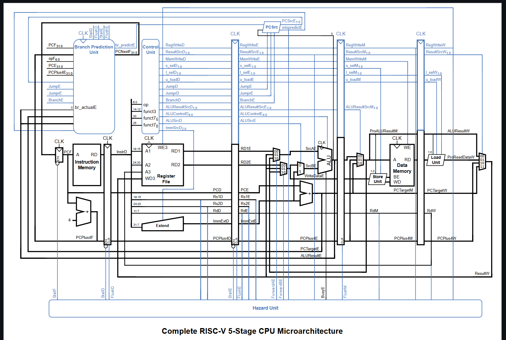
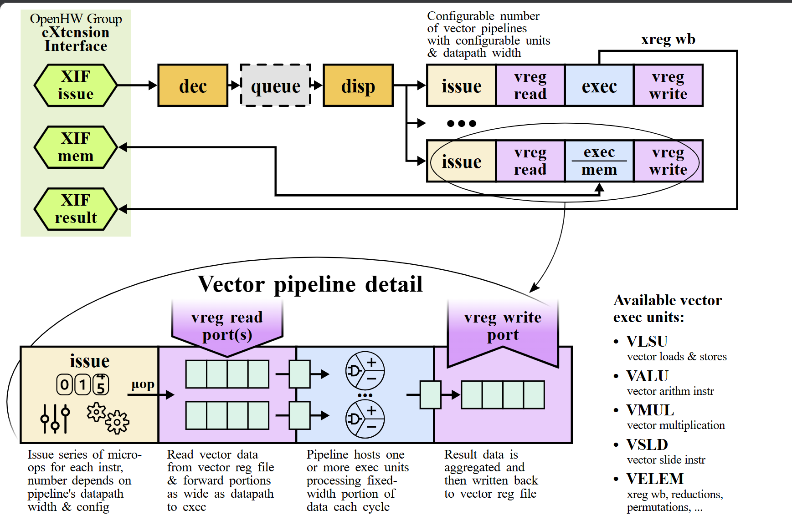

# RV32IM-Vicuna CV-X-IF Integration

RTL integration of the Vicuna RVV vector coprocessor with a custom RV32IM
scalar core using the CV-X-IF interface (OpenHW Group), targeting
DSP-style vector dot-product acceleration. Achieves a **3.62x cycle
reduction** on a 256-element kernel, synthesized at **100 MHz** on
GPDK45nm with **0 timing violations**.

Built as part of an M.Tech thesis on heterogeneous RISC-V compute for 5G
PHY DSP workloads (VLSI & Embedded Systems, DIAT Pune).

**[See exactly what was built vs. what's upstream IP -> CONTRIBUTIONS.md](CONTRIBUTIONS.md)**

---

## Results at a glance

| Stage | Description | Cycles | Speedup | Status |
|---|---|---|---|---|
| 1. Scalar baseline | RV32IM only, no vector coprocessor | 6944 | 1.00x | PASS |
| 2. Vicuna integration (LMUL=1) | Vector load/multiply/accumulate + one-time tree reduction | 4301 | 1.61x | PASS |
| 3. Final optimized (LMUL=4) | 4x register grouping + hardware `vredsum.vs` | **1916** | **3.62x** | PASS |

Full derivation: [`docs/optimization-journey.md`](docs/optimization-journey.md).

| Synthesis metric | Value |
|---|---|
| Target frequency | 100 MHz |
| Timing closure | MET (355 ps positive slack) |
| Total cells | 327,915 |
| Total area | 388,015.553 um^2 |
| Total power | 42.09 mW |

Full reports: [`synth/README.md`](synth/README.md).

All results are reproducible from the logs in [`sim/logs/`](sim/logs/) and
the verified kernel source in [`sw/kernels/`](sw/kernels/) -- nothing here
is hand-derived or estimated unless explicitly labeled as such.

---

## Architecture

The scalar core (a modified 5-stage RV32IM pipeline, originally from
[jeffreyc-dev/rv32im-5stage-cpu](https://github.com/jeffreyc-dev/rv32im-5stage-cpu))
decodes standard RVV opcodes (`OP-V`, `LOAD-FP`, `STORE-FP`) in
`control_unit.sv`, gating scalar `RegWrite`/`MemWrite` and forwarding
vector instructions to the Vicuna coprocessor
([vproc/vicuna](https://github.com/vproc/vicuna)) over the CV-X-IF
(Core-V eXtension Interface) protocol.


*Scalar core microarchitecture -- adapted from Jeffrey Core project documentation.*


*Vicuna RVV coprocessor / CV-X-IF pipeline structure -- adapted from Vicuna project documentation.*

`vicuna_wrapper.sv` is the original integration glue built for this
project: it bridges `vproc_core` to the Jeffrey Core scalar pipeline,
serving the same architectural role as Vicuna's own stock `vproc_top.sv`
(kept for reference at
[`docs/vproc_top_unused.sv`](docs/vproc_top_unused.sv)), which targets
Ibex/CV32E40X's memory conventions rather than Jeffrey Core's.

A shared memory arbiter in `rv32im_top.sv` gives Vicuna's vector loads/
stores priority over the scalar pipeline, avoiding deadlock while keeping
worst-case scalar stall bounded.

One notable design detail, verified in RTL and documented with waveform
evidence: a scalar-register writeback bypass (`v_xreg_we`) lets Vicuna
write reduction results directly into the scalar register file when a
vector instruction's destination register number coincides with a GPR
number -- see [`docs/debug-notes.md`](docs/debug-notes.md) (Bug 3) and
[`docs/waveforms/`](docs/waveforms/) for the full mechanism and captured
evidence.

---

## Repository structure

```
rtl/
  scalar_core/     Unmodified Jeffrey Core files (MIT)
  vector_coproc/   Unmodified Vicuna files (Solderpad/Apache-2.0)
  integration/     Modified + original integration files (this project's core work)
tb/                Integration-level testbench (black-box verification)
sw/
  kernels/         Verified dot-product kernel source (.s)
  mem_images/      Instruction/data memory hex images
sim/
  logs/            Real, unedited Xcelium simulation logs (all 3 stages)
synth/             Genus synthesis scripts, synthesis-safe RTL, and reports
docs/
  debug-notes.md            RTL-verified bug writeups from development
  optimization-journey.md   Stage-by-stage cycle count analysis
  waveforms/                Captioned waveform screenshots + evidence
  diagrams/                 Architecture diagrams (credited)
  vproc_top_unused.sv       Vicuna's stock wrapper, kept for reference only
THIRD_PARTY_LICENSES.md     Full license/attribution breakdown
LICENSE                     MIT (covers original work in this repo)
```

---

## License

This repository combines code under multiple licenses:

- **Original work** in this repository (integration RTL, testbench,
  documentation) -- **MIT**, see [`LICENSE`](LICENSE).
- **Jeffrey Core**-derived files (`rtl/scalar_core/`, unmodified portions
  of `rtl/integration/`) -- **MIT**.
- **Vicuna**-derived files (`rtl/vector_coproc/`, unmodified portions of
  `rtl/integration/`) -- **Solderpad Hardware License v2.1 / Apache
  License 2.0**.

Full breakdown, including diagram attributions:
[`THIRD_PARTY_LICENSES.md`](THIRD_PARTY_LICENSES.md).

---

## Documentation index

| Doc | Contents |
|---|---|
| [`docs/optimization-journey.md`](docs/optimization-journey.md) | Cycle-by-cycle breakdown of all 3 optimization stages, log-verified |
| [`docs/debug-notes.md`](docs/debug-notes.md) | RTL-verified bug writeups: X-propagation, `vredsum` race, port-count mismatch, and the scalar-bypass mechanism |
| [`docs/waveforms/`](docs/waveforms/) | Captioned Xcelium waveform screenshots proving the mechanisms described above |
| [`synth/README.md`](synth/README.md) | Full synthesis methodology, results, and honest discussion of memory-implementation limitations |

---

## Status

This repository reflects the final, working integration. Intermediate
development states (e.g. the LMUL=1 kernel's RTL configuration) were
iterated on directly rather than preserved as separate buildable
snapshots -- see the "Scope note" in `docs/optimization-journey.md` for
what is and isn't independently reproducible from this repo alone.

**Author:** Sanit Parashar -- M.Tech VLSI & Embedded Systems, DIAT Pune
